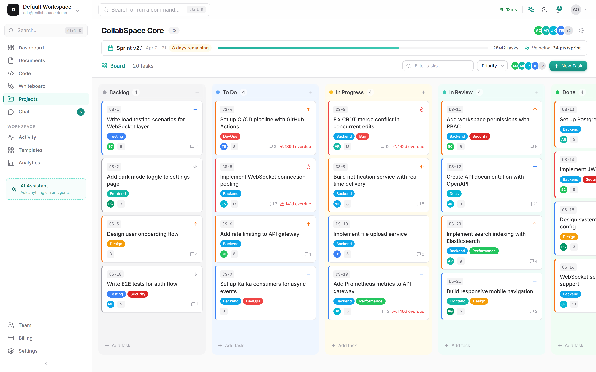
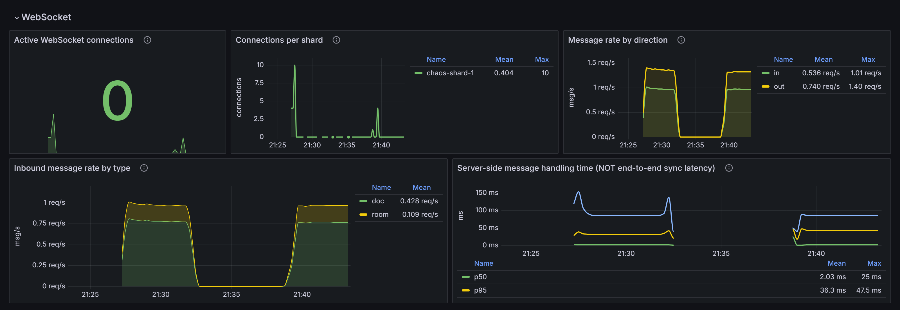

<p align="center">
  
</p>

<h1 align="center">CollabSpace</h1>

<p align="center">
  <strong>AI-Powered Collaboration Operating System</strong><br/>
  Docs &bull; Code &bull; Whiteboard &bull; Project Management &bull; AI Agents
</p>

<p align="center">
  <a href="https://github.com/parthksingh1/Collabspace/actions/workflows/ci.yml"></a>
  <a href="https://github.com/parthksingh1/Collabspace/actions/workflows/bench-smoke.yml"></a>
</p>

<!-- These badges report the live status of the real workflows in this repo.
     They are not pinned to a passing run and will go red if main breaks, which
     is the only kind of badge worth having. As of this commit the workflows
     have been rewritten but not yet run on GitHub, so the badge shows whatever
     the next push produces — verify it before relying on it. -->

<p align="center">
  
  
  
  
  
  
  
  
  
</p>

---

## Screenshots

<!-- TODO(parth): record these four files. Capture instructions, including how to
     get real data into Grafana first, are in docs/images/README.md.
     Until then these render as broken images — deliberately, so they can't be
     forgotten. Run scripts/seed-demo.ts first so nothing is empty. -->

| Real-time collaborative editing | Whiteboard |
|---|---|
|  |  |

| Kanban board | Grafana dashboard |
|---|---|
|  |  |

---

## Overview

CollabSpace is a **next-generation, AI-powered collaboration platform** that unifies real-time document editing, code collaboration, whiteboarding, and project management into a single workspace. Unlike traditional tools, CollabSpace features a **multi-agent AI system** where autonomous agents work alongside humans to plan sprints, review code, generate diagrams, and accelerate every aspect of teamwork.

---

## Proof & Reproducibility

Most of this README describes what the system is designed to do. This section is
where you check whether it does it.

| Document | What it gives you |
|---|---|
| [benchmarks/RESULTS.md](benchmarks/RESULTS.md) | Measured numbers, the methodology to reproduce them, and a claim-by-claim audit of every quantitative statement in this README against its evidence |
| [docs/INTERNALS.md](docs/INTERNALS.md) | How the CRDT layer actually works — Yjs item structure, the awareness protocol, the persistence path, the wire format |
| [docs/SHARDING.md](docs/SHARDING.md) | How the WebSocket tier scales across nodes, and its failure modes |
| [docs/DESIGN_DECISIONS.md](docs/DESIGN_DECISIONS.md) | Why each major dependency was chosen, and what I'd reconsider about each |
| [docs/LIMITATIONS.md](docs/LIMITATIONS.md) | Known defects, scalability ceilings and security gaps, with reproduction commands |
| [docs/RUNBOOK.md](docs/RUNBOOK.md) | Operating it: safe restarts, debugging a divergent document, force-reconciliation |

**Live demo:** <!-- TODO(parth): add the deployed URL here after following docs/DEPLOY.md -->
_not yet deployed_

### Run the evidence yourself

```bash
npm run test:integration   # CRDT convergence and offline reconciliation
npm run test:chaos         # kill a gateway node, restart Redis (needs Docker)
npm run bench:crdt         # measured convergence latency across 2/4/8/16 peers
```

`npm run test:integration` runs 11 CRDT-semantics tests with no infrastructure at
all, and 17 with a gateway running. `npm run test:chaos` brings up a two-node
topology, kills a node with 100 clients attached, and asserts no data is lost.

**Start with [docs/LIMITATIONS.md](docs/LIMITATIONS.md) if you are evaluating
this seriously.** It is the honest list of what is broken, partial or unproven,
and it is more useful than anything else here.

### Why CollabSpace?

| Traditional Tools | CollabSpace |
|---|---|
| Separate apps for docs, code, boards, tasks | **Unified workspace** with deep cross-module integration |
| AI bolted on as a chatbot | **Multi-agent AI system** that autonomously executes work |
| Single-server architecture | **Distributed microservices** with horizontal WebSocket sharding (50K concurrent users is a design target — see [benchmarks/RESULTS.md](benchmarks/RESULTS.md) for measured numbers) |
| Polling-based updates | **Real-time CRDT sync** (latency is a design target — see [benchmarks/RESULTS.md](benchmarks/RESULTS.md) for measured numbers) |
| Cloud-only | **Offline-first** with automatic reconciliation |

---

## Key Features

### Collaborative Document Editor
- **Tiptap** rich-text editor with full formatting (headings, lists, code blocks, tables, images)
- **Yjs CRDT** for conflict-free real-time collaboration
- Multi-cursor presence with user names and colors
- Inline comments, @mentions, threaded discussions
- Version history with time-travel and restore
- Offline editing with automatic sync on reconnect
- Slash command menu for quick insertions

### Collaborative Code Editor
- **Monaco Editor** (VS Code engine) with 7+ language support
- Real-time collaboration via CRDT synchronization
- **Docker-sandboxed code execution** (256MB RAM, 10s timeout, no network)
- Contest mode with timed coding rooms, auto-grading, and leaderboards
- File tree with folder management
- Integrated terminal output panel

### Collaborative Whiteboard
- **Infinite canvas** with pan, zoom, and grid snapping
- 12 element types: rectangles, ellipses, lines, arrows, text, sticky notes, freehand, connectors, groups, frames
- Real-time CRDT sync for all element changes
- Properties panel with fill, stroke, opacity, layer controls
- Export to PNG, SVG, PDF
- AI-powered: prompt-to-diagram, diagram-to-code, auto-layout

### Project Management
- **Kanban board** with drag-and-drop (powered by @hello-pangea/dnd)
- List view with sortable columns and inline editing
- Timeline/Gantt view with dependency arrows
- Sprint management with burndown charts and velocity tracking
- Task relationships (blocks, is blocked by, relates to)
- Automatic task key generation (PROJ-1, PROJ-2, ...)
- AI-powered task breakdown and sprint planning

### Multi-Agent AI System
- **5 specialized agents**: Planner, Developer, Reviewer, Meeting, Knowledge
- **Agent Orchestrator** for multi-agent workflows and inter-agent communication
- Multi-LLM architecture: **Gemini** (primary) + **OpenAI** (fallback)
- Dynamic routing: code tasks to coding models, long context to Gemini Pro
- Tool-calling framework with codebase search, code execution, task management
- Short-term memory (Redis) + long-term memory (vector DB)
- Predictive collaboration: conflict prediction, intent detection, cursor heatmaps

### Advanced Platform Features
- AES-256-GCM encryption utility (implemented in `packages/shared`, **not yet wired into any service** — see [docs/LIMITATIONS.md](docs/LIMITATIONS.md))
- RBAC + ABAC authorization with 5 roles and resource-level permissions
- Comprehensive audit logging
- Real-time notifications (in-app, email, push) with deduplication and batching
- Command palette (Ctrl+K) for quick navigation and AI commands
- Dark/light/system theme support
- Responsive design across all screen sizes

---

## Architecture

```
                                    ┌──────────────┐
                                    │   CDN/Edge   │
                                    └──────┬───────┘
                                           │
                               ┌───────────┴───────────┐
                               │     Nginx / Ingress    │
                               │   (SSL, Rate Limit)    │
                               └───┬───────────────┬───┘
                                   │               │
                          ┌────────┴────┐  ┌───────┴──────┐
                          │ Next.js App │  │  API Gateway  │
                          │  (Port 3000)│  │  (Port 4000)  │
                          └─────────────┘  └───┬───────────┘
                                               │
              ┌────────────┬───────────┬───────┴───────┬─────────────┐
              │            │           │               │             │
        ┌─────┴─────┐ ┌───┴────┐ ┌────┴────┐  ┌──────┴──────┐ ┌────┴────┐
        │   Auth    │ │  Doc   │ │  Code   │  │  Board      │ │Project  │
        │  Service  │ │Service │ │ Service │  │  Service    │ │Service  │
        │  (4002)   │ │(4003)  │ │ (4004)  │  │  (4005)     │ │(4006)   │
        └───────────┘ └────────┘ └─────────┘  └─────────────┘ └─────────┘
              │            │           │               │             │
              │        ┌───┴───────────┴───────────────┴─────────────┘
              │        │
        ┌─────┴────────┴────┐      ┌──────────────┐     ┌───────────────┐
        │ WebSocket Gateway │      │  AI Service   │     │ Notification  │
        │     (4001)        │      │   (4008)      │     │   Service     │
        │  Sharded Rooms    │      │  Multi-Agent  │     │   (4007)      │
        └───────┬───────────┘      └───────┬───────┘     └───────┬───────┘
                │                          │                     │
       ┌────────┴──────────────────────────┴─────────────────────┘
       │
  ┌────┴────┐  ┌──────────┐  ┌────────────┐  ┌──────────────┐
  │  Redis  │  │PostgreSQL│  │   Kafka    │  │  Vector DB   │
  │ Cluster │  │(Supabase)│  │  Cluster   │  │  (Pinecone)  │
  └─────────┘  └──────────┘  └────────────┘  └──────────────┘
```

> For detailed architecture documentation, see [ARCHITECTURE.md](docs/ARCHITECTURE.md).

---

## Tech Stack

| Layer | Technology |
|-------|-----------|
| **Frontend** | Next.js 14, React 18, TypeScript, TailwindCSS, Zustand, React Query |
| **Editors** | Tiptap (documents), Monaco Editor (code), Canvas API (whiteboard) |
| **Real-time** | WebSocket (ws), Yjs CRDT, y-protocols |
| **Backend** | Node.js, Express, TypeScript |
| **Database** | PostgreSQL 16 (via Supabase), Redis 7 |
| **Messaging** | Apache Kafka |
| **AI** | Gemini API, OpenAI API, Custom Agent Framework |
| **Vector DB** | Pinecone |
| **Containers** | Docker, Kubernetes (GKE) |
| **IaC** | Terraform |
| **CI/CD** | GitHub Actions |
| **Monitoring** | Prometheus, Grafana, Jaeger |

---

## Monorepo Structure

```
collabspace/
├── apps/
│   ├── web/                     # Next.js 14 frontend (60 files)
│   ├── api-gateway/             # API Gateway with circuit breaker (15 files)
│   ├── ws-gateway/              # WebSocket Gateway with sharding (17 files)
│   ├── auth-service/            # Authentication & authorization (17 files)
│   ├── doc-service/             # Document collaboration service (15 files)
│   ├── code-service/            # Code editor & execution service (15 files)
│   ├── board-service/           # Whiteboard service (17 files)
│   ├── project-service/         # Project management service (19 files)
│   ├── ai-service/              # AI orchestration & agents (36 files)
│   └── notification-service/    # Multi-channel notifications (16 files)
├── packages/
│   ├── shared/                  # Shared types, utils, constants (10 files)
│   ├── crdt/                    # CRDT engine wrapper (7 files)
│   ├── ai-sdk/                  # AI abstraction layer (14 files)
│   └── ui/                      # Shared UI components (25 files)
├── infra/
│   ├── docker/                  # Docker Compose, Dockerfiles, nginx
│   ├── k8s/                     # Kubernetes manifests (base + overlays)
│   └── terraform/               # GKE, Cloud SQL, Redis, networking
├── tests/
│   └── load/                    # k6 load testing scenarios
├── docs/                        # Documentation
├── .github/workflows/           # CI/CD pipelines
├── turbo.json                   # Turborepo configuration
├── package.json                 # Root workspace config
└── tsconfig.json                # Root TypeScript config
```

**Total: 454 tracked files** (`git ls-files | wc -l`). I've dropped the
"production-ready" label that used to be here — it's a judgement rather than a
measurement, and it isn't one I'd defend for every file. See
[docs/LIMITATIONS.md](docs/LIMITATIONS.md) for the parts I wouldn't.

---

## Quick Start

### Prerequisites

- **Node.js** >= 20.0.0
- **Docker** & Docker Compose
- **Git**

### 1. Clone & Install

```bash
git clone https://github.com/your-org/collabspace.git
cd collabspace
npm install
```

### 2. Environment Setup

```bash
cp .env.example .env
# Edit .env with your API keys:
#   - GEMINI_API_KEY
#   - OPENAI_API_KEY (optional, fallback)
#   - PINECONE_API_KEY (for AI memory)
```

### 3. Start Infrastructure

```bash
# Start PostgreSQL, Redis, Kafka, and monitoring stack
npm run docker:up
```

This starts:
- PostgreSQL (port 5432) with auto-migration
- Redis (port 6379)
- Kafka + ZooKeeper (port 9092)
- Prometheus (port 9090)
- Grafana (port 3001)
- Jaeger (port 16686)

### 4. Start Development Servers

```bash
# Start all services in development mode
npm run dev
```

Or start individual services:

```bash
# Terminal 1: Frontend
cd apps/web && npm run dev

# Terminal 2: API Gateway
cd apps/api-gateway && npm run dev

# Terminal 3: WebSocket Gateway
cd apps/ws-gateway && npm run dev

# Terminal 4: Auth Service
cd apps/auth-service && npm run dev

# ... (repeat for other services)
```

### 5. Access the Application

| Service | URL |
|---------|-----|
| **Web App** | http://localhost:3000 |
| **API Gateway** | http://localhost:4000 |
| **WebSocket** | ws://localhost:4001 |
| **Grafana** | http://localhost:3001 |
| **Jaeger** | http://localhost:16686 |
| **Prometheus** | http://localhost:9090 |

Default admin credentials:
- Email: `admin@collabspace.io`
- Password: `Admin123!`

---

## Development

### Available Scripts

```bash
npm run dev          # Start all services in dev mode
npm run build        # Build all packages and services
npm run lint         # Lint all packages
npm run test         # Run all tests
npm run typecheck    # Type-check all TypeScript
npm run clean        # Clean all build artifacts

npm run docker:build # Build Docker images
npm run docker:up    # Start Docker infrastructure
npm run docker:down  # Stop Docker infrastructure

npm run db:migrate   # Run database migrations
npm run db:seed      # Seed database with sample data

npm run load-test    # Run k6 load tests
```

### Adding a New Service

1. Create a new directory under `apps/`
2. Add `package.json` with `@collabspace/` namespace
3. Add `tsconfig.json` extending root config
4. Register proxy route in `apps/api-gateway/src/routes/proxy.routes.ts`
5. Add Docker config in `infra/docker/docker-compose.yml`
6. Add Kubernetes manifests in `infra/k8s/base/`

### Code Style

- TypeScript strict mode everywhere
- Functional components with hooks in React
- TailwindCSS for all styling (no CSS modules)
- Zod for runtime validation
- Structured JSON logging

---

## Deployment

### Docker Compose (Development/Staging)

```bash
docker-compose -f infra/docker/docker-compose.yml up -d
```

### Kubernetes (Production)

```bash
# Apply base manifests
kubectl apply -k infra/k8s/base/

# Apply production overlay
kubectl apply -k infra/k8s/overlays/production/
```

### Terraform (GKE Infrastructure)

```bash
cd infra/terraform
terraform init
terraform plan
terraform apply
```

> For detailed deployment instructions, see [docs/DEPLOYMENT.md](docs/DEPLOYMENT.md).

---

## Verified Scale

Two columns, because the difference matters. **Design target** is what the
architecture is built for. **Measured** is what has actually been observed on
real hardware — and where it says "not yet measured", nothing has been run and no
number should be inferred.

_Measured column as of 2026-09-04._

| Metric | Design target | Measured |
|---|---|---|
| Concurrent users | 50,000+ | **Not yet measured.** Highest actually exercised is 100 clients across 2 nodes in `tests/chaos/`. The 50K figure is arithmetic from the sharding design, not an observation. |
| Concurrent WebSocket connections | 10,000 per node | **Not yet measured.** Harness exists (`npm run bench:ws`, ramps to 5,000) but k6 is not installed on the machine this was developed on. |
| Real-time latency | <30ms | **Not yet measured.** `npm run bench:crdt` measures true convergence directly; it has not been run. Note any local figure would be loopback-only and would flatter this badly. |
| API response time | p95 <200ms | **Not yet measured.** Encoded as a k6 threshold in `benchmarks/api-throughput.js`, so a run either passes it visibly or fails visibly. |
| Document sync | <50ms | **Not yet measured.** Same harness as real-time latency. |
| Cross-node document sync | Works at all | **Verified.** 100 clients sharded across 2 gateway nodes converge to identical state; a `SIGKILL` of one node loses no data and sync resumes (`tests/chaos/ws-node-failure.test.ts`). |
| CRDT convergence correctness | Always converges | **Verified.** 17 tests covering concurrent edits, same-position conflicts, insert/delete races, commutativity, idempotency and offline reconciliation (`npm run test:integration`). |
| Redis restart survival | No data loss | **Verified.** Document content survives, the shard registry heals, both nodes agree afterwards (`tests/chaos/redis-restart.test.ts`). |
| Multi-region | 3+ regions | **Not implemented.** Terraform provisions a single regional GKE cluster. |
| Availability | 99.95% | **Unverifiable.** No production deployment exists. This is an aspiration, not a measurement. |

Why so many blanks: k6 is not installed on the development machine, so the load
benchmarks have never been run. Writing plausible-looking numbers would have been
easy and would have been the exact thing this pass exists to prevent.
[benchmarks/RESULTS.md](benchmarks/RESULTS.md) has the methodology to fill them
in, and the rules I hold myself to when doing so.

---

## Monitoring & Observability

- **Prometheus** scrapes metrics from all services (`/metrics` endpoint)
- **Grafana** dashboards for request rates, latency, error rates, WebSocket connections, Kafka lag
- **Jaeger** for distributed tracing across services
- **Structured logging** in JSON format with correlation IDs

Access Grafana at `http://localhost:3001` (auto-provisioned dashboards).

---

## Security

- **Authentication**: JWT with access/refresh token rotation
- **Authorization**: RBAC (5 roles) + ABAC (ownership, time-based conditions)
- **Encryption**: AES-256-GCM for data at rest, TLS 1.3 in transit
- **Rate Limiting**: Sliding window per-IP and per-user with Redis
- **Input Validation**: Zod schemas on all API boundaries
- **Audit Logging**: All state-changing actions logged with actor, IP, timestamp
- **Container Security**: Non-root users, read-only filesystems, seccomp profiles
- **Code Execution Sandbox**: Docker containers with no network, memory/CPU limits

> For security policies and incident response, see [docs/SECURITY.md](docs/SECURITY.md).

---

## Documentation

| Document | Description |
|----------|-------------|
| [README.md](README.md) | This file — project overview and quick start |
| [docs/ARCHITECTURE.md](docs/ARCHITECTURE.md) | System architecture deep-dive |
| [docs/API_REFERENCE.md](docs/API_REFERENCE.md) | Complete API endpoint documentation |
| [docs/DEPLOYMENT.md](docs/DEPLOYMENT.md) | Deployment guide (Docker, K8s, Terraform) |
| [docs/CONTRIBUTING.md](docs/CONTRIBUTING.md) | Development workflow and guidelines |
| [docs/SECURITY.md](docs/SECURITY.md) | Security model and policies |
| [docs/INTERNALS.md](docs/INTERNALS.md) | How the CRDT layer works — Yjs internals, awareness, persistence, wire format |
| [docs/SHARDING.md](docs/SHARDING.md) | WebSocket sharding, cross-node fanout, failure modes |
| [docs/DESIGN_DECISIONS.md](docs/DESIGN_DECISIONS.md) | Why each dependency was chosen, and what I'd reconsider |
| [docs/LIMITATIONS.md](docs/LIMITATIONS.md) | Known defects, ceilings and security gaps — read this one |
| [docs/RUNBOOK.md](docs/RUNBOOK.md) | Operations: restarts, debugging divergence, reconciliation |
| [benchmarks/RESULTS.md](benchmarks/RESULTS.md) | Measured numbers and the README claim audit |
| [tests/README.md](tests/README.md) | Test layers, what runs without infrastructure, and what is untested |

---

## Trade-offs & What I'd Change

<!-- TODO(parth): these are grounded in real findings from the codebase, but they
     are written in my voice, not yours. Rewrite them the way you'd say them —
     especially the last one, where the lesson you'd actually draw matters more
     than the one I drew. Add or cut freely; six is not a magic number. -->

- **I paid for a compact binary CRDT format and then encoded it as JSON.** A
  single-character edit is 24 bytes as a Yjs update and roughly 90–100 bytes once
  the gateway renders it as a JSON array of numbers. I chose JSON envelopes
  because they were uniform and debuggable in a browser network tab, which was
  genuinely useful while building — but it is a ~4× cost on the hot path,
  forever, for a convenience I no longer need. Binary framing is the first thing
  I'd change.

- **Building the shard ring was more interesting than wiring it up, so I did the
  interesting part.** `shard-manager.ts` has a correct consistent-hash ring with
  150 virtual nodes and a binary-search lookup. Nothing calls it. Meanwhile the
  thing that actually needed to exist — relaying room messages between nodes —
  did not, so any multi-node deployment silently split documents in half with no
  error anywhere. That is the failure mode I'd least like to ship and I shipped
  it.

- **Nothing tested the seam between the web client and the gateway, so nobody
  noticed they speak different protocols.** The browser sends binary frames; the
  gateway only parses JSON. Both sides are individually reasonable and
  individually tested. The integration tests I added pass because they speak the
  gateway's protocol correctly — they validate the server, not the client. Tests
  that cover components but not the boundaries between them buy less confidence
  than their count suggests.

- **`|| echo "non-blocking"` on the typecheck script was a decision to stop
  looking.** It hides 93 real type errors across six packages, and CI swallows
  failures the same way. Every one of those was a deliberate small act of
  deferral that added up to strict mode being aspirational precisely where it was
  failing. Deleting the escape hatch is a day of work I keep not doing.

- **I chose the conventional technology rather than the right-sized one, more
  than once.** Kafka plus ZooKeeper for an event volume Redis Streams would
  handle comfortably; Monaco's multi-megabyte bundle for a code editor that is a
  secondary feature. Neither is wrong exactly, but both were picked because they
  are the answer you give when someone asks what you'd use, not because I'd
  measured that I needed them.

- **The claims I was least able to support were the ones I made loudest.** "50,000+
  concurrent users" and "<30ms latency" were the two headline numbers, and they
  had the weakest evidence of anything in this README — architecture arithmetic
  presented in the typeface of a measurement. The benchmarks in `benchmarks/`
  exist now, they have not been run, and the README says so rather than
  splitting the difference.

---

## License

This project is licensed under the MIT License. See [LICENSE](LICENSE) for details.

---

<p align="center">
  Built with care by the CollabSpace team<br/>
  <strong>Docs &bull; Code &bull; Whiteboard &bull; Projects &bull; AI — All in One</strong>
</p>
